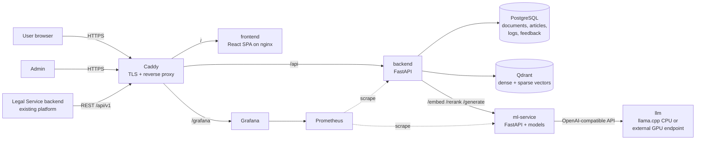

# Adilet Search — Project Plan (final project)

> This is the single source of truth for scope, architecture, timeline and responsibilities.
> **Agents:** read this file fully at the start of every new session.
> **Humans:** fill in owners and gate dates in §10.

---

## 1. What we are building

Legal Service (https://test.tehprof.kz/legal, Tehsnab Group) already ingests legal acts from adilet.zan.kz and serves them through a web UI, but its search only matches keywords. **Adilet Search** is the AI module that fixes this. It:

- understands a plain-language question in **Russian or Kazakh**;
- retrieves the **articles** that answer it, even when the wording differs from the statute (hybrid semantic + lexical retrieval, then re-ranking);
- returns them with the exact source (act, article, revision date, link to adilet) in **≤ 2 s (p95)**;
- optionally writes a short **answer with inline citations** `[1]`, `[2]` from those articles (RAG), streamed to the UI;
- logs queries and feedback, shows them in an **admin panel**, and is **monitored** and **deployed** at a public HTTPS URL.

### Scope of the prototype

| In scope (MVP) | Stretch (only after gate G4) | Out of scope |
|---|---|---|
| Tier-1 corpus: 7 major codes (8 documents), RU + KK (§6) | Tier-2 corpus: ~30 key laws + selected bylaws | The whole of adilet.zan.kz |
| Hybrid search + reranker, filters, RU/KK | Cross-lingual search (KK query → RU article) | End-user accounts, payments |
| Streaming RAG answer with validated citations | Embeddable search widget for Legal Service | Legal advice; answers without sources |
| Article viewer with RU↔KK switch | Query autocomplete, dark theme | Changes to the customer's production system |
| Keyword-vs-smart **compare page** (for the demo) | Alerts to Telegram/e-mail | |
| Admin: stats, query log, system/index status, reindex | | |
| Prometheus + Grafana, structured logs | | |
| Docker Compose deployment with HTTPS, tests, docs | | |

---

## 2. What we must hand in

### 2.1 Final assignment: requirement, artifact, owner

| Requirement | Artifact | Owner |
|---|---|---|
| Final model picked from earlier experiments, loaded, ready for inference, versioned, inputs/outputs described | `ml-service` + `ml/models/model_manifest.json` + `ml/MODEL_CARD.md` | ML |
| API | backend `/api/v1/*`, `contracts/openapi.json` | Backend |
| User interface | frontend SPA (search, answer, article, compare, admin) | Frontend |
| Testing | pytest (ml, backend), contract tests, load test, Vitest, Playwright | all |
| Monitoring | Prometheus + Grafana dashboard, admin dashboard, query logs | Backend (+ Frontend for the admin UI) |
| Deployment in an accessible environment | public HTTPS URL, `docs/tech/deployment.md` | Backend |
| Technical documentation | `docs/tech/*`, READMEs, model card | all |
| Final presentation, 7–10 slides | `docs/presentation/final_deck.md` (Marp → PPTX/PDF) | all; assembled with `agents/shared/final_assembly.md` |

### 2.2 Earlier assignments (mostly ML; the same codebase serves them)

| Assignment | ML phase | Key outputs |
|---|---|---|
| A2: Data preparation & baseline | ML-03 | cleaned corpus, eval set, BM25 + TF-IDF/LogReg baselines, ≥2 metrics, results, slides |
| A3: Training & fine-tuning | ML-04 | ≥3 configs on one split, tuning, fine-tuned bi-encoder, transfer learning, QLoRA generator, unified table |
| A4: Embeddings → ML → Transformer → fine-tuning | ML-05 | 4 configs for relevance classification/re-ranking, error analysis, RQ1–RQ4, report, slides, checkpoint |

If an assignment has already been submitted, give the ML agent the existing notebook and results and ask it to port them into `ml/experiments/` instead of redoing the work.

### 2.3 Coverage of the customer's requirements (TOR)

| TOR requirement | How we cover it |
|---|---|
| Natural-language queries in RU/KZ, semantic analysis | multilingual embedder (fine-tuned), language detection, Kazakh-aware parsing |
| Corpus embeddings, vector database | article-level chunks in Qdrant (dense + sparse vectors) |
| RAG, exact citation of articles | `/answer` with validated `[n]` citations linked to articles |
| Relevance ranking | hybrid fusion + cross-encoder reranker; nDCG@10 and MRR@10 reported |
| Fine-tuning on Kazakhstan legislation | bi-encoder and reranker fine-tuned on corpus queries; QLoRA generator |
| API integration with the existing backend | REST API + `docs/tech/integration_guide.md` (+ optional widget) |
| Response time ≤ 2 s | `/search` p95 ≤ 2 s, shown by a load test |
| Scalability, fault tolerance | stateless backend, versioned index behind an alias, health checks, degraded mode (full-text fallback), backups |
| Query logging, admin panel | query and feedback logs in Postgres, admin UI |
| Data protection | HTTPS, admin auth, rate limits, no raw personal data in logs, secrets in env |
| Server/RAM/GPU selection | `docs/tech/infrastructure_sizing.md` with measured numbers |
| Extensibility (AI assistant, explanations of norms) | the RAG answer endpoint and prompt templates are the base for an assistant |

---

## 3. Architecture



### Services

| Service | Tech | Owner | Internal port |
|---|---|---|---|
| `caddy` | Caddy 2 (automatic HTTPS, reverse proxy) | Backend | 80/443 |
| `frontend` | React SPA served by nginx | Frontend | 8080 |
| `backend` | FastAPI, Python 3.12 | Backend | 8000 |
| `ml-service` | FastAPI + sentence-transformers / ONNX Runtime | ML | 8001 |
| `llm` | llama.cpp server with a GGUF model (CPU), or an external OpenAI-compatible GPU endpoint | ML | 8002 |
| `postgres` | PostgreSQL 16 | Backend | 5432 |
| `qdrant` | Qdrant | Backend | 6333 |
| `prometheus`, `grafana` | monitoring | Backend | 9090 / 3000 |

### Search flow: `POST /api/v1/search` (budget: p95 ≤ 2 s)

1. Backend validates the query (1–500 chars), detects the language (`ru`/`kk`) and checks the result cache.
2. `ml-service /embed` (kind = `query`) returns a dense vector and a sparse BM25 vector. *Target ≤ 150 ms.*
3. Qdrant runs a dense search and a sparse search (top 50 each) with payload filters: language, act, type, in force. *Target ≤ 100 ms.*
4. Backend fuses the two lists with weighted RRF and collapses chunks into articles. The formula is fixed in `contracts/ml_service.md`, so offline experiments and production compute the same thing.
5. `ml-service /rerank` scores the top 30 articles. *Target ≤ 900 ms on CPU.*
6. Backend returns the top-k with snippets, metadata, scores, per-stage timings and the model version, then logs the query asynchronously.

If the ML service or Qdrant is down, Postgres full-text search takes over and the response is flagged `degraded`.

### Answer flow: `POST /api/v1/answer` (Server-Sent Events)

1. Run the search pipeline, then load the full text of the top 5 articles.
2. Emit `sources` straight away, so the UI shows the sources while the answer is generated.
3. `ml-service /generate` builds the prompt (the template is owned by ML) and streams from the LLM.
4. Backend relays `token` events and checks the citations: each `[n]` must point to a source it provided. It then emits `done` and stores the answer.

The 2-second requirement applies to `/search`. Generation is streamed. On a GPU the target time to first token is ≤ 3 s; on CPU we measure it and report it honestly.

---

## 4. Technology choices

| Area | Choice | Why |
|---|---|---|
| Python tooling | Python 3.12, uv, ruff, pytest | fast, reproducible environments with lockfiles |
| API | FastAPI, Pydantic v2, SQLAlchemy 2 (async) + Alembic, httpx, sse-starlette, structlog | async streaming, OpenAPI generated from code |
| Vector DB | Qdrant: dense + sparse named vectors, payload indexes, collection aliases | hybrid retrieval in one store; aliases give zero-downtime reindexing and rollback |
| Relational DB | PostgreSQL 16 | documents, logs, feedback, admin, full-text fallback |
| ML | PyTorch, transformers, sentence-transformers, peft, trl, bitsandbytes, bm25s, scikit-learn, LightGBM, Optuna, ranx | standard and well documented |
| Serving | FastAPI ml-service; ONNX Runtime where it cuts CPU latency; llama.cpp (CPU) or vLLM (GPU) behind an OpenAI-compatible API | the LLM backend can change without code changes |
| Frontend | React + TypeScript (strict) + Vite, Tailwind + shadcn/ui, TanStack Query, React Router, i18next, Recharts, openapi-typescript + openapi-fetch, MSW | API types come from the contract; development is mock-first |
| Tests | pytest, schemathesis, locust, Vitest + Testing Library, Playwright + axe | |
| Infra | Docker Compose, Caddy, Prometheus, Grafana, GitHub Actions | deployment to one VM with automatic HTTPS |
| Artifacts | Hugging Face Hub (private): datasets, checkpoints, LoRA adapters, GGUF | shared across laptops, Colab and the server |
| Slides | Marp (Markdown → PPTX/PDF) | agents can write slides as text |

Library versions are pinned by each part's lockfile. A change to this table goes through `docs/decisions.md`.

---

## 5. Repository layout and ownership

```
adilet-search/
├── CLAUDE.md                  shared rules for all agents
├── README.md                  for humans
├── docker-compose.yml         dev stack                          (Backend)
├── docker-compose.prod.yml    deployment                         (Backend)
├── .env.example               all env vars, documented           (Backend; others request additions)
├── contracts/                 interfaces between parts
│   ├── api.md                 public REST API                    (Backend)
│   ├── openapi.json           generated from backend code        (Backend)
│   ├── ml_service.md          internal ML API, manifest, fusion  (ML)
│   ├── data_schema.md         corpus, eval data, index layout    (ML)
│   ├── fixtures/              shared test vectors                (ML)
│   └── CHANGELOG.md           every contract change              (shared, append-only)
├── agents/                    prompts for the three agents
├── docs/
│   ├── PROJECT_PLAN.md        this file
│   ├── decisions.md           decision log                       (shared, append-only)
│   ├── status/                ml.md · backend.md · frontend.md   (one per agent)
│   ├── tech/                  architecture, api, ml, frontend, deployment, runbook, …
│   ├── report/                A2–A4 reports, final eval, load test
│   └── presentation/          Marp decks, sections, demo script, screenshots
├── data/                      git-ignored except sample/ and eval/   (ML)
├── ml/                        package, notebooks, serving, experiments, reports (ML)
├── backend/                   app, indexer, fake ML service, tests, load tests (Backend)
├── frontend/                  SPA, mocks, e2e tests                   (Frontend)
└── infra/                     caddy, prometheus, grafana config       (Backend)
```

---

## 6. Data plan

- **Source.** The customer's DB export if Tehsnab Group provides one. Otherwise our own polite scraper of adilet.zan.kz: raw HTML cached, ≤ 1 request/s, robots.txt respected.
- **Tier-1 corpus (RU + KK):** Labor Code, Code on Administrative Offences, Civil Code (General Part and Special Part), Tax Code (the edition currently in force; verify on adilet), Environmental Code, Entrepreneurial Code, Criminal Code. Roughly 4–5k articles per language.
- **Unit.** One article (or one top-level point for acts that have no articles). Articles longer than ~400 tokens are split into chunks. Each chunk gets the header "Act. Article N. Title" for embedding.
- **Metadata.** Act, type, number, adoption date, revision date, act status (in force / repealed / not yet in force), article status (in force / excluded), amendment notes, source URL, RU↔KK parallel id.
- **Evaluation data.**
  - *Gold:* ≥ 150 realistic queries (≥ 100 RU, ≥ 50 KK), including the three TOR examples and ~20 that the corpus cannot answer. Humans label relevance (0/1/2) using pooling.
  - *Synthetic:* 2–3 generated queries per article (plain-language + statutory terminology), for training and for validation at scale.
  - *Splits* use a language-independent article key (`doc_id` + unit), are frozen once in `data/eval/splits.json` and reused by every experiment. Gold queries are never used for training.
- **Sharing.** The full data and the models live in private Hugging Face repos. `data/sample/` (small) and `data/eval/` are committed to git.
- **Human effort needed:** writing and editing gold queries plus labelling, about 3–4 hours per person in weeks 2–3.

---

## 7. ML plan (summary; details in `agents/ml/`)

| Stage | Candidates | Selected by |
|---|---|---|
| Lexical baseline | BM25 (tuned k1, b), TF-IDF | nDCG@10 on val |
| Dense embedder | multilingual-e5 (base/large), BGE-M3, LaBSE; the best one fine-tuned (MNRL + hard negatives) | nDCG@10, Recall@50, CPU latency |
| Fusion | weighted RRF (k and weights tuned on val) | nDCG@10 |
| Reranker | LogReg/LightGBM on embedding features, zero-shot cross-encoder, fine-tuned cross-encoder | nDCG@10, MRR@10, ROC-AUC/F1, CPU latency |
| Generator | open ~7–8B instruct LLM, base vs QLoRA | citation validity and precision, faithfulness, refusal accuracy, TTFT |

**Metrics.** Retrieval: **nDCG@10** (primary), **Recall@10/50**, **MRR@10**. Classification: ROC-AUC, F1, PR-AUC. Generation: citation precision, faithfulness, refusal accuracy. System: p50/p95 latency, TTFT, error rate.

**ML is the critical path.** If it falls behind, use these levers: the base LLM from service v0 keeps the answer feature working while QLoRA is late, and A4 re-uses the A3 training setup.

---

## 8. Non-functional targets

| Target | Value | Shown by |
|---|---|---|
| `/search` latency | p95 ≤ 2 s at 10 concurrent users on the deployment hardware | locust report (`docs/report/load_test.md`) |
| `/answer` time to first token | ≤ 3 s on GPU; CPU value measured and reported | ML-07 API evaluation |
| Fault tolerance | health checks, restart policies, degraded mode | drill: stop `ml-service` and search still answers (flagged `degraded`) |
| Security | HTTPS, admin JWT + bcrypt, rate limits, CORS allowlist, hashed session ids, no secrets in git | `docs/tech/security.md` checklist |
| Reproducibility | fixed seeds, pinned versions, config per run, notebooks run top to bottom | ML reports |

---

## 9. Hardware and deployment

- **Training:** Colab/Kaggle GPUs (T4/L4/P100). Checkpoints are pushed to the HF Hub after every epoch.
- **Prototype server:** one Linux VM with ≥ 4 vCPU, 16 GB RAM, 80 GB SSD. Use the customer's test VM if they give one; otherwise rent a VPS. The search path runs on CPU.
- **Generator:** a quantised GGUF on CPU via llama.cpp (slow but it works), or, for demo day, an external GPU endpoint with the same OpenAI-compatible API. Switching between them is an env-var change.
- **Public URL:** HTTPS via Caddy (a customer subdomain or our own domain).

---

## 10. Timeline and gates

Six weeks by default. If the deadline is closer, compress by merging weeks, but never skip a gate.

| Week | ML | Backend | Frontend | Gate at end of week |
|---|---|---|---|---|
| 1 | 00 + 01 corpus, **sample in ~2 days** | 00 + 01 skeleton, fake ML, openapi stubs | 00 + 01 scaffold, mocks, shell | **G0:** `docker compose up` green on fake ML; `openapi.json` committed; `data/sample/` committed; UI shell runs on mocks |
| 2 | 02 ml-service v0; start gold query drafting | 02 indexer + search | 02 search UI | **G1, walking skeleton:** a real query on real sample data through the real UI, real API and real zero-shot models |
| 3 | 03 eval set + baselines (**A2**); full Tier-1 corpus | 03 answer (SSE), feedback, query logs | 03 answer panel, article viewer | **G2:** RAG v0 end to end; full Tier-1 corpus indexed |
| 4 | 04 comparison, fine-tuning, QLoRA (**A3**) | 04 admin, monitoring, resilience, security | 04 admin panel | **G3:** admin panel and Grafana show live data; degraded-mode drill passes |
| 5 | 05 (**A4**) + 06 final pipeline v1.0.0 | 05 tests, CI, load test | 05 live integration, compare page, polish | **G4:** v1.0.0 models indexed; all test suites green; `/search` p95 ≤ 2 s measured |
| 6 | 07 API evaluation, model card, ML slides | 06 deployment + 07 docs | 06 tests + production build, 07 demo | **G5:** public URL live; docs complete; deck exported; demo rehearsed with a backup video |

| Role | Human owner | | Gate | Date |
|---|---|---|---|---|
| ML | ____________ | | G0 | ______ |
| Backend | ____________ | | G1 | ______ |
| Frontend | ____________ | | G2 | ______ |
| | | | G3 | ______ |
| | | | G4 | ______ |
| | | | G5 / defence | ______ |

---

## 11. How the agents work together

- **One agent per part.** Each agent is its own Claude Code session (ideally one teammate each). The standing brief is `agents/<role>/00_general.md`; the phase prompts are `01…07`. See `agents/README.md` for the exact messages to send.
- **They communicate through files:** the status files (`docs/status/*.md`), `contracts/CHANGELOG.md` and `docs/decisions.md`. Humans relay the important parts ("ML says the sample is in `data/sample/`, see its status file").
- **Nobody waits:**
  - Backend never waits for ML; it uses the contract-compliant fake ML service.
  - Frontend never waits for Backend; it uses MSW mocks typed from `openapi.json`.
  - ML ships a sample in week 1 and a zero-shot service v0 in week 2, so integration starts early. Better models later only bump the manifest version.
- **Gates.** At each gate every agent runs `agents/shared/gate_check.md`. Humans merge, run the full stack, and note the result in the status files.

---

## 12. Risks

| Risk | Likelihood | Mitigation |
|---|---|---|
| adilet blocks scraping, or its HTML is inconsistent | M | ask the customer for a DB export; cache raw HTML; start with one code; parser tests on saved fixtures |
| Gold labelling takes longer than planned | H | pooling (label only the top-20 candidates); split across three people; start in week 2 |
| Colab/Kaggle GPU quota runs out | M | small models first; checkpoint to the HF Hub every epoch; QLoRA instead of full fine-tuning |
| Reranker too slow on CPU, so p95 > 2 s | M | ONNX int8, fewer candidates, a smaller cross-encoder, caching; choose by measured latency |
| LLM on CPU too slow for a live demo | H | stream the answer and show sources first; smaller GGUF; external GPU endpoint on demo day; recorded backup video |
| Kazakh quality is weaker | H | report per-language metrics honestly; Kazakh-specific error analysis; list it as future work |
| Hallucinated or wrong citations | M | citation validation, refusal examples in the SFT data, UI disclaimer, faithfulness evaluation |
| The three parts drift apart | M | contracts, generated types, openapi drift check in CI, weekly gates |
| Outdated law shown as current | M | status metadata; "in force only" filter on by default; revision date on every result |
| OneDrive / Cyrillic path breaks tooling | H | move the repo before starting (see README) |

---

## 13. Final presentation (7–10 slides)

| # | Slide | Content | Source |
|---|---|---|---|
| 1 | Problem | keyword search fails on plain questions; one concrete example | ML + compare-page screenshot (FE) |
| 2 | Dataset | corpus statistics, eval set, splits, labelling agreement | ML |
| 3 | Model | pipeline (hybrid → reranker → generator) and why these models | ML |
| 4 | Experimental results | one unified table A2 → A4, one chart | ML |
| 5 | Final model | v1.0.0 manifest, inputs/outputs, versioning | ML |
| 6 | System architecture | diagram, search and answer flows | Backend |
| 7 | Deployment | compose topology, URL, CI, monitoring | Backend |
| 8 | Demonstration | live demo (with a backup video) | Frontend |
| 9 | Performance | latency p50/p95, load test, quality measured through the API | Backend + ML |
| 10 | Limitations and future work | an honest list | all |

---

## 14. Definition of Done (final)

- [ ] Public HTTPS URL serves the UI; `/api/v1/health` reports `ok`.
- [ ] Search answers RU and KK queries; results show the act, article, status, revision date and an adilet link.
- [ ] The answer streams; every citation opens the right article; the disclaimer is shown.
- [ ] The compare page shows keyword vs smart search on the demo queries.
- [ ] The admin panel shows stats, the query log, query details, system status and reindex.
- [ ] Grafana dashboard is live; the degraded-mode drill passes.
- [ ] `/search` p95 ≤ 2 s in the load test on the deployment hardware.
- [ ] Pipeline v1.0.0 is pinned in the manifest; the model card describes inputs and outputs; checkpoints are on the HF Hub.
- [ ] All test suites and CI are green; `openapi.json` is up to date.
- [ ] `docs/tech/` is complete (architecture, API, ML, frontend, deployment, runbook, security, integration guide, infrastructure sizing).
- [ ] A2, A3 and A4 notebooks run top to bottom on a fresh Colab runtime; reports and slides are in `docs/`.
- [ ] Final deck exported to PPTX/PDF; demo script rehearsed; backup video recorded.
