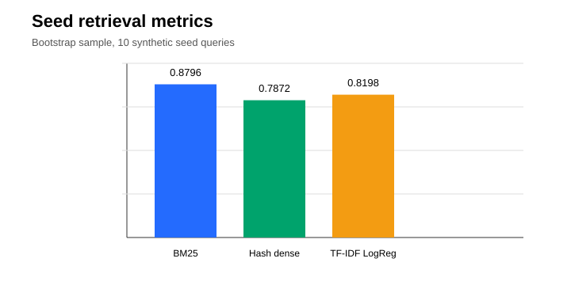

# A2: Data and Baseline

- Contract-shaped corpus sample
- Seed retrieval labels and splits
- BM25 and TF-IDF/logistic baselines

---

# Dataset

- 2 document rows
- 30 article rows
- 33 chunk rows
- RU and KK sample articles
- Excluded article, amendment notes, long split article

---

# Metrics

- nDCG@10: primary ranking quality
- Recall@10/50: answer article retrieved
- MRR@10: first relevant result position
- ROC-AUC/F1/PR-AUC: learned reranker classification

---

# Results

---

# Conclusion

BM25 is strongest on this seed set by nDCG@10. The next step is replacing seed labels with 150+
human-labelled gold queries over the official Tier-1 corpus.

<!-- source: ml/reports/results.csv -->
